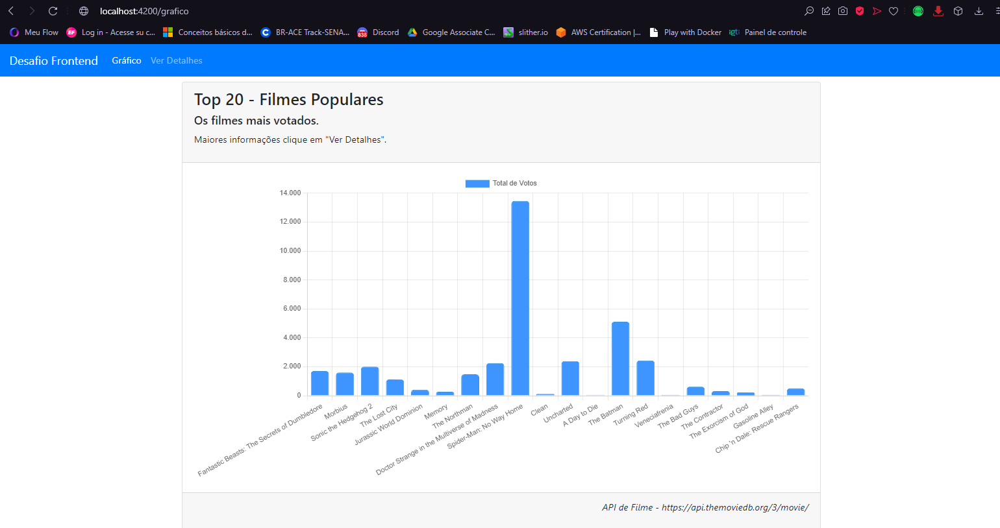
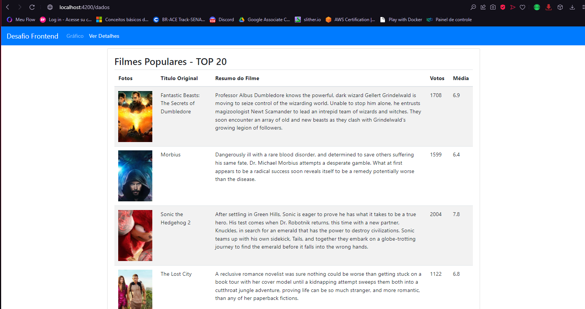

# WiproDesafioFrontend
Carlos Alexandre Cavalheiro

* Tecnologias e Frameworks utilizandos:
      
> 
 Angular

> 
BootStrap

> 
 ChartJS

> 
 API com autenticação JWT

* Telas da Aplicação:

 Angular

 Angular

